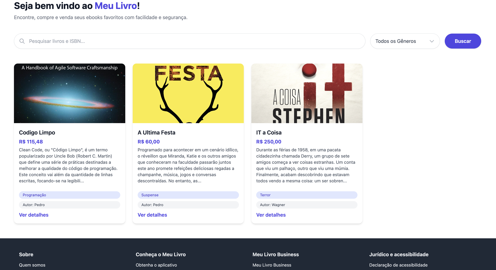

## Meu Livro 📚
Meu Livro é um sistema de ecommerce onde vende ebooks

## Galeria de Imagens

| Imagem 1 | Imagem 2 |
|----------|----------|
|  |  |

| Imagem 3 | Imagem 4 |
|----------|----------|
|  |  |

## Licença

O projeto Meu Livro é um software de código aberto licenciado sob a [licença MIT](https://opensource.org/licenses/MIT).

